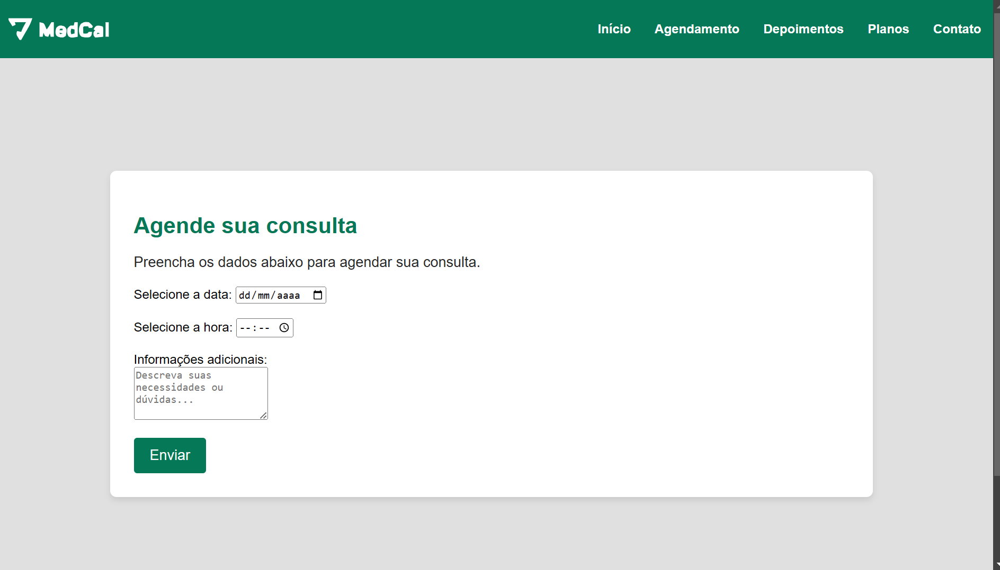

# MedCal - Documentação do Projeto

## Visão Geral

MedCal é uma plataforma web projetada para facilitar o gerenciamento de consultas médicas. O projeto oferece funcionalidades como agendamento online, depoimentos de clientes, informações sobre planos e contato direto com a equipe. A interface é intuitiva e responsiva, garantindo uma experiência de usuário agradável.

## Contexto do Projeto

Este projeto foi desenvolvido em equipe durante o curso da Proz, idealizado pela parceria entre a AWS e a Meta. O portal tem o intuito de facilitar o acesso a serviços médicos de qualidade, permitindo que os usuários agendem consultas de forma prática e eficiente. Seja para quem prefere atendimento presencial ou online, a MedCal está aqui para ajudar.

## Estrutura do Projeto

O projeto é composto por várias páginas HTML, cada uma com um propósito específico. Abaixo está uma breve descrição de cada uma:

### Páginas Principais

1. **inicio.html**: Página de boas-vindas que destaca a missão da MedCal e oferece uma visão resumida das principais funcionalidades, como consultas, médicos, e informações de contato.

2. **agendamento.html**: Página dedicada ao agendamento de consultas, onde os usuários podem selecionar a data e hora desejadas e fornecer informações adicionais.

3. **depoimentos.html**: Apresenta depoimentos de clientes satisfeitos com os serviços da MedCal, destacando a qualidade e eficiência do atendimento.

4. **contato.html**: Página de contato que permite aos usuários enviar mensagens diretamente para a equipe da MedCal através de um formulário.

### Estrutura de Navegação

Cada página contém um cabeçalho com um menu de navegação que permite fácil acesso a todas as seções do site. O rodapé inclui ícones de redes sociais para promover o engajamento com os usuários.

### Estilos e Scripts

- **CSS**: O projeto utiliza arquivos CSS para estilizar as páginas, garantindo uma aparência consistente e profissional. Os estilos são organizados em arquivos separados para cada página e componentes comuns.
  
- **JavaScript**: Scripts são utilizados para validação de formulários e outras interações dinâmicas.

## Tecnologias Utilizadas

- **HTML5**: Estruturação das páginas web.
- **CSS3**: Estilização e layout responsivo.
- **JavaScript**: Funcionalidades interativas e validação de formulários.

## Como Executar o Projeto

1. **Clone o Repositório**: Baixe o projeto para o seu computador.
2. **Abra o Arquivo HTML**: Utilize um navegador web para abrir qualquer um dos arquivos HTML para visualizar a página correspondente.
3. **Navegue pelo Site**: Utilize o menu de navegação para explorar as diferentes seções do site.

## Imagens

# Projeto Original

https://github.com/digidweb/sprintTalentCloud.git